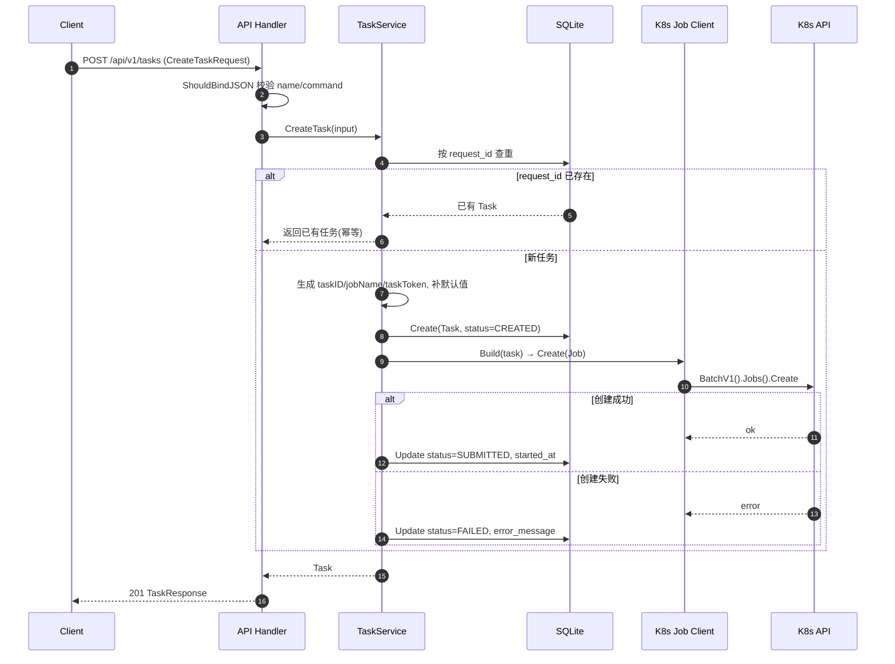
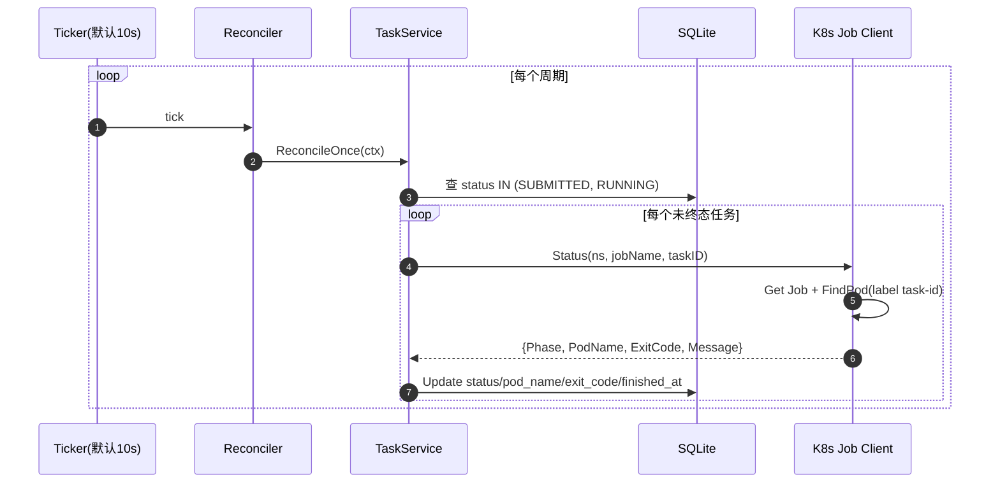
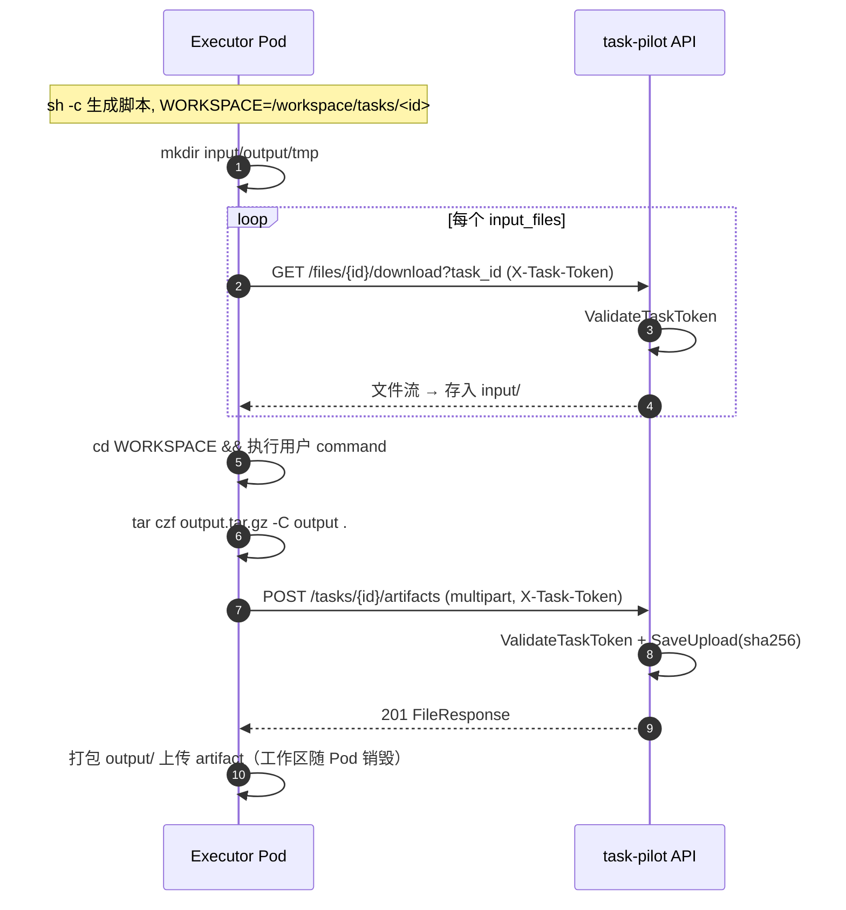

# task-pilot 开发指南（DEVELOPMENT）

> 版本基线：Go 1.22 + Gin + GORM(SQLite) + Kubernetes `batch/v1 Job`
> 定位：不依赖 Argo/CRD 的自动化任务调度执行系统 MVP
> 本指南面向后续开发者，覆盖架构、模块职责、数据模型、时序图、详细 API 参数、扩展点与避坑清单。

---

## 1. 系统定位与设计取舍

task-pilot 接收 HTTP 请求 → 落库元数据 → 在 Kubernetes 上拉起原生 Job（executor Pod）执行用户命令 → 后台 reconciler 轮询同步状态 → 通过 HTTP 上传/下载在服务与 Job 之间传递文件。

| 维度 | 选择 | 原因 / 代价 |
|------|------|-------------|
| 编排 | 原生 `batch/v1 Job` | 零 CRD、零额外控制器；无 DAG/依赖编排能力 |
| 元数据 | SQLite + GORM | 单文件免运维；**单实例**，无法水平扩展 |
| 状态同步 | 轮询式 reconciler（默认 10s） | 实现简单；有延迟，大规模有查询压力 |
| 文件传输 | HTTP 上传/下载（executor curl） | 跨节点可用；每 Job 独立 emptyDir 工作区，硬隔离 |
| 幂等 | `request_id` 唯一索引 | 重复提交返回已有任务，不重复建 Job |

---

## 2. 目录结构与模块职责

```text
cmd/server/main.go            服务入口：装配依赖、启动 reconciler goroutine、启动 HTTP
internal/config/config.go     Viper 配置加载（默认值 + yaml + 环境变量 + APP_CONFIG）
internal/db/sqlite.go         打开 SQLite 并 AutoMigrate 两张表
internal/model/               GORM 模型：Task、FileObject
internal/service/task_service 任务状态机与业务编排（心脏）
internal/job/
  ├── client.go               clientset 封装：Create/Delete/Status/FindPod/Logs
  ├── template.go             Task → batchv1.Job 组装 + executor 启动脚本生成
  └── status.go               Job/Pod 原始状态 → 内部 Phase 映射
internal/scheduler/reconciler 定时器：周期性调用 service.ReconcileOnce
internal/filetransfer/
  └── service.go              上传落盘 + sha256 + 元数据入库 / 下载打开
internal/api/                 router 路由表、handler 处理器、dto 请求响应体
internal/util/                id 生成（crypto/rand hex）、时间指针
```

---

## 3. 数据模型

### 3.1 Task（`internal/model/task.go`）

| 字段 | 类型 | 说明 |
|------|------|------|
| `ID` | string 主键 | `task-<16hex>`，`util.NewID("task")` 生成 |
| `RequestID` | string 唯一索引 | 幂等键 |
| `Name` | string | 任务名 |
| `Namespace` | string | K8s namespace，空则用配置默认 |
| `JobName` | string 索引 | `<taskID>-job` |
| `PodName` | string 索引 | reconciler 发现后回填 |
| `Image` | string | 执行镜像，空则用 default_image |
| `Command` | text | 用户命令 |
| `InputPath`/`OutputPath` | string | 兼容用输入输出路径 |
| `InputFilesJSON` | text | `[]InputFileSpec` 的 JSON（不外泄） |
| `Status` | string 索引 | 状态机，见 §5 |
| `ExitCode` | *int | 容器退出码 |
| `ErrorMessage` | text | 失败诊断 |
| `TimeoutSeconds` | int64 | → Job `ActiveDeadlineSeconds` |
| `TaskToken` | string | `token-<16hex>`，executor 回调鉴权（不外泄） |
| `CreatedAt/UpdatedAt/StartedAt/FinishedAt` | time | 时间戳 |
| `DeletedAt` | gorm.DeletedAt | 软删除 |

`InputFileSpec`：`{file_id, filename, mount_path}` — 描述一个需在 Job 内下载的输入文件。

### 3.2 FileObject（`internal/model/file_object.go`）

| 字段 | 说明 |
|------|------|
| `ID` | `file-<16hex>` |
| `TaskID` | 关联任务（产物必填，输入可空） |
| `Purpose` | `input` 或 `artifact` |
| `Filename`/`Path`/`Size`/`Sha256` | 文件元数据（Path 不外泄） |

存储布局：`{storage_dir}/{purpose}/{fileID}/{basename}`。建表由 `AutoMigrate` 完成，无独立 migration；AutoMigrate 不删列/不改类型，破坏性变更需手动处理。

---

## 4. 时序图

### 4.1 创建任务



### 4.2 状态同步（reconciler）



### 4.3 Executor 文件传输链路



---

## 5. 任务状态机

状态定义在 `model.TaskStatus`：`CREATED / SUBMITTED / RUNNING / SUCCEEDED / FAILED / CANCELLED`。

责任分工：

- **CREATED → SUBMITTED / FAILED**：`CreateTask` 同步完成。
- **SUBMITTED/RUNNING → RUNNING/SUCCEEDED/FAILED**：`ReconcileOnce` 异步驱动。
- **→ CANCELLED**：`CancelTask` 删 Job 后直接置终态，不经 reconciler。

Phase 映射（`job/status.go` 的 `FromJobAndPod`）：先看 Job 的 `Complete/Failed` condition，再用 `Active>0` 推断 Running；Pod 存在时以 `Pod.Phase` 覆盖，并从 `ContainerStatuses.Terminated` 提取 `ExitCode`/message。内部 Phase → TaskStatus：`Pending/Running→RUNNING`，`Succeeded→SUCCEEDED`，`Failed→FAILED`。

---

## 6. 详细 API 参数

Base 路径：`/api/v1`。除健康检查外均返回 JSON。错误统一为 `{"error": "..."}`。

### 6.1 `GET /healthz`

- 请求：无参数。
- 响应 `200`：`{"status":"ok","name":"task-pilot"}`

### 6.2 `POST /api/v1/tasks` 创建任务

请求体 `CreateTaskRequest`（`application/json`）：

| 字段 | 类型 | 必填 | 默认 | 说明 |
|------|------|------|------|------|
| `request_id` | string | 否 | — | 幂等键；重复则返回已有任务 |
| `name` | string | **是** | — | 任务名 |
| `namespace` | string | 否 | 配置 `kubernetes.namespace` | K8s 命名空间 |
| `image` | string | 否 | 配置 `default_image` | 执行镜像 |
| `command` | string | **是** | — | 在 `$WORKSPACE` 下执行的 shell 命令 |
| `input_files` | array | 否 | — | 输入文件清单，见下 |
| `timeout_seconds` | int64 | 否 | 配置 `default_timeout_seconds`(3600) | ≤0 时用默认；映射 Job deadline |

`input_files[]`（`InputFileSpec`）：

| 字段 | 类型 | 说明 |
|------|------|------|
| `file_id` | string | 已上传文件的 ID；空则跳过 |
| `filename` | string | 落地文件名；空时取 `mount_path` 的 basename，再空取 `file_id` |
| `mount_path` | string | 参考路径（仅取 basename，不信任绝对路径） |

- 响应 `201`：`{"task": Task}`（关注 `id`/`job_name`/`status`）。
- 错误 `400`（参数校验）/ `500`（建库或建 Job 失败）。

### 6.3 `GET /api/v1/tasks` 任务列表

- 请求：无参数。返回按 `created_at desc` 排序、最多 **100** 条。
- 响应 `200`：`{"tasks": [Task, ...]}`

### 6.4 `GET /api/v1/tasks/:id` 单任务

- 路径参数：`id` — 任务 ID。
- 响应 `200`：`{"task": Task}`；`404` 不存在。

### 6.5 `GET /api/v1/tasks/:id/logs` 日志摘要

- 路径参数：`id`。
- 响应 `200`（map）：

| 字段 | 说明 |
|------|------|
| `task_id`/`job_name`/`pod_name` | 标识 |
| `logs` | executor 容器最近 200 行日志（成功时） |
| `message`/`error` | 读日志失败时的提示与错误 |
| `kubectl_get_job`/`kubectl_get_pods`/`kubectl_logs` | 排查命令 |

### 6.6 `POST /api/v1/tasks/:id/cancel` 取消

- 路径参数：`id`。删除对应 Job（NotFound 视为成功），置 `CANCELLED`。
- 响应 `200`：`{"task": Task}`。

### 6.7 `POST /api/v1/tasks/:id/retry` 重试

- 路径参数：`id`。基于原任务参数创建**新任务**（`name` 加 `-retry` 后缀，新 ID/新 Job）。
- 响应 `201`：`{"task": Task}`（新任务）。

### 6.8 `POST /api/v1/files/upload` 上传文件

- `multipart/form-data`：

| 字段 | 必填 | 说明 |
|------|------|------|
| `file` | 是 | 文件内容 |
| `purpose` | 否 | `input`(默认) 或 `artifact` |
| `task_id` | 否 | 关联任务 |

- 限制：大小 ≤ `max_file_size_mb`（默认 10MB）。
- 响应 `201`：`FileResponse` `{file_id, filename, size, purpose, sha256}`；`400` 参数/超限。

### 6.9 `GET /api/v1/files/:id/download` 下载文件

- 路径参数：`id`。
- Query：`task_id`（可选）——**带 `task_id` 时**必须携带请求头 `X-Task-Token`，否则 `401`。
- 响应 `200`：文件流（`Content-Disposition: attachment`）；`404` 不存在。

### 6.10 `POST /api/v1/tasks/:id/artifacts` 上传产物

- 路径参数：`id`。请求头 `X-Task-Token`（**必填**，executor 回调用）。
- `multipart/form-data`：`file`（必填）。purpose 强制为 `artifact`。
- 响应 `201`：`FileResponse`；`401` token 无效；`400` 无文件。

### 6.11 `GET /api/v1/tasks/:id/artifacts` 列出产物

- 路径参数：`id`。返回该任务 `purpose=artifact` 的文件，按 `created_at desc`。
- 响应 `200`：`{"artifacts": [FileResponse, ...]}`。

---

## 7. 配置系统（`internal/config`）

Viper 优先级（低→高）：内置 `SetDefault` → `configs/config.example.yaml` → 环境变量（`.`→`_`，如 `SERVER_ADDR`）→ `APP_CONFIG` 指定文件覆盖。

关键配置块：`server.addr`、`database.path`、`kubernetes.*`（namespace/两个 SA/default_image/default_timeout/backoff_limit(默认0)/ttl_seconds_after_finished(默认1天)）、`file_transfer.*`（workspace_mount_path/storage_dir/max_file_size_mb/`service_base_url`(集群内必须可达)）、`eval.encryption_secret`、`scheduler.reconcile_interval_seconds`。

---

## 8. 扩展点

| 需求 | 落点 | 说明 |
|------|------|------|
| 新增 API | `api/router.go` + `handler.go` + `dto.go` | 三处联动，dto 用 gin binding 校验 |
| 新增任务字段 | `model/task.go` + `CreateTaskInput` + dto | AutoMigrate 自动加列 |
| 改 Job 规格 | `job/template.go` 的 `Build` | 加 resources/nodeSelector/PVC 等 |
| 改 executor 行为 | `job.buildScript` | 保持 shell 转义与 basename 防护 |
| 状态映射调整 | `job/status.go` | Job condition / Pod phase → Phase |
| 文件后端换 S3/MinIO | `filetransfer/service.go` | 抽象接口后替换本地磁盘 |
| 事件驱动替代轮询 | `scheduler` + `job/client` | 引入 Informer/Watch 降延迟 |
| 多副本水平扩展 | `db` 层 | 换 Postgres/MySQL + 分布式锁 |

---

## 9. 避坑清单

1. **SQLite 单实例**：`replicas:1` 是硬约束，多副本会数据错乱。
2. **emptyDir 丢数据**：部署样例 SQLite 存 emptyDir，Pod 重启即清空，生产必须换 PVC。
3. **工作区不持久化**：每 Job 的 `/workspace` 是独立 emptyDir，Pod 销毁即清；产物必须走 artifacts HTTP 上传，勿依赖工作区存活。
4. **`service_base_url` 必须集群内可达**：executor 靠它回调传文件，配错则任务起但传文件失败。
5. **Cancel 是终态**：取消后即使 Job 实际成功也不翻转。
6. **`backoff_limit:0`**：Job 默认不重试；业务重试用 `/retry`（建新任务，非同一 Job）。
7. **reconcile 错误静默**：单任务查询失败只 `continue`，排查卡住任务看服务日志。
8. **emptyDir 占节点磁盘**：超大产物任务多时可能写满节点，必要时给卷加 `SizeLimit`。
9. **无 Dockerfile/无 CI**：镜像与流水线需自建；提交前手动跑 `gofmt`+`go test`+`go build`。
10. **shell 注入防护**：改 `buildScript` 时务必保留 `filepath.Base` + `shellDoubleQuoteInner` 两层转义。

---

## 10. 快速上手 checklist

- [ ] 读 `cmd/server/main.go` 理解装配顺序
- [ ] 读 `service/task_service.go` 理解状态机（核心）
- [ ] 读 `job/template.go` 的 `buildScript` 理解 executor 实际执行什么
- [ ] 跑 `examples/curl.sh` 走通一次完整链路
- [ ] 准备可访问的 K8s 集群 + 正确 kubeconfig
- [ ] 部署前替换 `<TASK_PILOT_IMAGE>` 并确认 RBAC `can-i` 为 yes
